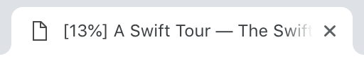

# Page progress

This bookmarklet will show reading progress in the title bar and update it on scroll. Readable source code in `index.js`



## Installation

1. Create bookmark
2. Paste this code instead of URL:

```javascript

javascript:(function()%7Bconst%20title%20%3D%20document.title%3Bconst%20updateProgress%20%3D%20()%20%3D%3E%20document.title%20%3D%20'%5B'%20%2B%20Math.round(document.documentElement.scrollTop%20*%20100%20%2F%20document.body.scrollHeight)%20%2B%20'%25%5D%20'%20%2B%20title%3BupdateProgress()%3Bwindow.addEventListener(%22scroll%22%2C%20updateProgress)%7D)()

```

## Usage

Click on the bookmark and it'll show the progress in the title.

To remove it just reload the page.
